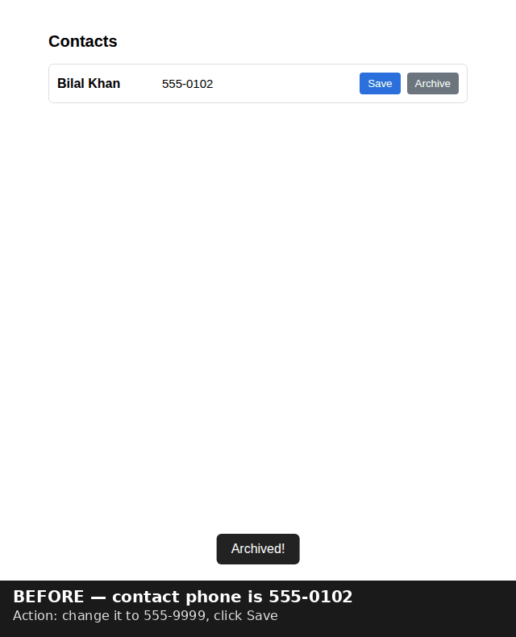

# Satya

**Catches UIs that lie about what the backend did.** Satya drives a web app with Playwright, records what the UI *claims* happened (toast text, DOM changes), checks what *actually* persisted (backend state via your API, or the page itself after a reload), and flags any mismatch.

[](https://www.python.org/)
[](https://playwright.dev/python/)
[](https://fastapi.tiangolo.com/)
[](.github/workflows/tests.yml)
[](LICENSE)

| | |
|---|---|
| **Catches** | A delete that shows "Deleted!" but never persists · a save that shows "Saved!" but keeps the old value · a page that doesn't reliably show saved data after a refresh · an API response carrying data the page never shows |
| **Ground truth** | **API**: reads your backend before and after each action (apps you own). **Reload**: reloads the page and checks the claimed change survived, with no backend access needed (apps you don't). |
| **Verdicts** | `AGREE`, `UI_LIED`, `NO_REQUEST`, `BACKEND_ERROR`, `DATA_LEAK`, `UNSTABLE_RENDER`, or the inconclusive `NO_CLAIM` / `ACTION_FAILED` (coverage gaps, not passes) |
| **Outputs** | CLI summary with exit codes, HTML report with before/after screenshots, JUnit XML and JSON for CI |
| **Runs as** | Python library, CLI, Playwright middleware, local FastAPI service + dashboard with SQLite run history, or a browser extension (read-only smoke check) |
| **Tested on** | 102 tests (no browser needed), two demo apps with seeded bugs, and seven third-party TodoMVC apps, where it found a real render race in the Sammy.js build ([docs/VALIDATION.md](docs/VALIDATION.md)). Not yet run against a large production app. |



*Actual output from `scripts/run_demo.py`: the phone-number edit renders "Updated!" and the new
value, but the request that fired never carried the field, so the backend never changed. Satya
reports `UI_LIED` instead of a false pass.*

Screenshot diffs and a human glancing at the page all pass these bugs, because the page renders exactly what it promised. Satya acts on the UI and checks the UI's *claim* against what actually persisted.

The dashboard's two URL modes are different things. A **smoke check** (the default, read-only) reports HTTP status, console errors and failed requests, and does **not** verify UI claims. A **truthfulness check** (`allow_mutations: true`) runs your flows with reload ground truth. It performs real actions, so the service refuses it unless `allowed_domains` is set explicitly. Only point it at a test environment you control. Start the service with `PYTHONPATH=src uvicorn service.app:app --port 8099`.

## Quickstart

```bash
pip install -r requirements.txt
playwright install chromium
python scripts/run_demo.py     # boots two buggy demo apps, runs the agent against both
pytest tests/                  # unit tests, no browser required
```

`scripts/run_demo.py` starts the task-manager demo app (three deliberate, hidden bugs) and a
second, independently-styled contacts app (different markup, selectors, and toast mechanism —
see "Scope and current limitations"), then points the agent at each one twice: bugs on (should
catch the lies) and bugs off (should confirm everything agrees). It also writes a self-contained
HTML report to `demo_output/demo_report.html` with before/after screenshots for every flow.
Runs in well under a minute; a checked-in sample of that report and of the CLI's output
(`demo_output/*.html`, `demo_output/cli_junit.xml`) is included so you can see the shape of the
output without running anything.

For CI or scripted use without writing Python glue, see "Command-line usage" below.

For a module-by-module walkthrough of the pipeline (browser agent → claim inference → backend
diff → reconciler) and how the four interfaces sit on top of it, see [docs/ARCHITECTURE.md](docs/ARCHITECTURE.md).

## The core idea, in one picture

```
                    ┌─────────────────────────┐
                    │  agent loop: act on a    │
                    │  UI flow (click, type)   │
                    └────────────┬────────────┘
                                 │
                    ┌────────────▼────────────┐
                    │  browser agent           │
                    │  Playwright + network    │
                    │  interception            │
                    └────────────┬────────────┘
                                 │  acts on
                    ┌────────────▼────────────┐
                    │  the app under test      │
                    └──────┬───────────┬───────┘
              observes     │           │    observes
         ┌─────────────────▼──┐    ┌───▼──────────────────┐
         │  VISUAL channel     │    │  BACKEND channel      │
         │  toast text + DOM   │    │  real HTTP traffic +  │
         │  delta = what the   │    │  API state = what     │
         │  UI *claims*        │    │  *actually* happened  │
         └─────────┬───────────┘    └───────────┬───────────┘
                   │                             │
          ┌────────▼─────────┐                   │
          │ claim inference  │                   │
          │ "UI says it did  │                   │
          │  a REMOVAL of #1"│                   │
          └────────┬─────────┘                   │
                   │                             │
                   └──────────┬──────────────────┘
                    ┌─────────▼──────────┐
                    │  reconciler         │
                    │  does the claim     │
                    │  match reality?     │
                    └─────────┬───────────┘
                              │
        verdict: AGREE / UI_LIED / NO_REQUEST / BACKEND_ERROR / DATA_LEAK
```

The whole design hinges on **two independent observation channels**. Purely-visual testing
only has the left one — so a UI that renders a convincing lie passes. Satya adds the right
one (what the backend actually did) and makes *the gap between them* the thing it reports.

## What makes this an agent, not a test script

The important design decision: Satya does **not** contain a `verify_delete` function with a
hand-written rule that says "a delete should remove the record from the backend." That would
just be a test script with network assertions, and it would only work for flows someone
pre-wrote.

Instead the agent **infers what the UI claimed** from generic, observable signals and checks
that inferred claim against a generic backend diff. There is no per-flow logic anywhere in
the pipeline:

1. **Claim inference** (`agent/claim.py`) reads the toast wording ("Deleted!" → a removal
   claim, "Saved!" → a mutation claim, "Added!" → a creation claim) and the DOM delta (which
   row disappeared, which value changed, which row is new) to build a structured `Claim`:
   *kind* (REMOVAL / MUTATION / CREATION / SUBMISSION), whether success was asserted, the
   target item, and — for edits — the new value the UI now shows.
2. **Backend diff** (`reconcile/backend.py`) snapshots the backend's records before and after
   the action and diffs them generically into removed / added / changed, tied to no
   particular schema.
3. **Reconciliation** (`reconcile/reconciler.py`) is a single `reconcile(claim, diff, trace)`
   function that checks any claim kind against the diff. A REMOVAL claim expects a record to
   have left; a MUTATION expects the named field to actually hold the claimed value; a
   CREATION expects a new record. No `if delete / if save` branches.

Because nothing is flow-specific, the pipeline handles flows it was never written for. The
test suite includes exactly this: a CREATION flow with no dedicated code path, which the
agent still forms a claim for, catches when the backend didn't actually gain the record, and
passes when it did.

### The seam for a smarter claim-inferrer

`infer_claim(before, after)` is a deliberate function boundary. The current implementation is
a heuristic engine over common UI patterns (toasts, list mutations, field edits). A
vision-language-model claim-inferrer — one that reads the before/after screenshots and the
toast and reasons about intent for *arbitrary* UIs — would implement the same signature and
drop in without touching the reconciler or the agent loop. That's the honest upgrade path
from "works on common patterns" to "reads any UI," and it's left as a clean seam rather than
pretended-away.

## The demo app and its bugs

`src/agent_demo/app.py` is a self-contained FastAPI app serving both a small task-manager
frontend and its JSON API, built to contain exactly the bugs Satya targets. All three are
invisible on screen — the UI renders correctly in every case:

- **Fake delete (`NO_REQUEST`)** — clicking Delete removes the row from the DOM and shows
  "Deleted!", but the frontend never sends `DELETE /api/tasks/{id}`. The task is still on the
  server; a refresh brings it back.
- **Fake save (`UI_LIED`)** — editing a title and clicking Save shows "Saved!" and updates
  the input, but the `PUT` request body omits the title field, so the server keeps the old
  value. UI and backend silently diverge.
- **Data leak (`DATA_LEAK`)** — the task list response carries an internal
  `_internal_owner_email` field the frontend never displays but that is present in the
  network payload, readable by anyone inspecting traffic.

Add `?bugs=off` and the same app behaves correctly, so the demo shows the agent both catching
the lies and — importantly — staying silent when the app is actually working (no false
alarms).

`src/contacts_demo/app.py` is a second, independently-styled demo target (a contacts list, not
a task manager) with completely different markup, CSS classes, a `data-contact-id` attribute
instead of `data-id`, and a `.banner[role=status]` toast instead of `#toast`. It reuses the same
three bug *classes* (fake archive = `NO_REQUEST`, fake update = `UI_LIED`, leaked
`_private_notes` = `DATA_LEAK`) through different flows, specifically so that pointing
`BrowserAgent` at it — with new selector arguments and nothing else — is the generalization
claim made concrete rather than just asserted. `scripts/run_demo.py` runs both apps.

## What the demo prints

With bugs **on**, three problems caught, each with a plain-English explanation:

```
Flow: click Delete on task 1
  UI claimed: toast='Deleted!', DOM rows 3->2
  Network:    (no API calls)
  !! [NO_REQUEST] UI asserted a removal succeeded, but no state-changing request was sent.

Flow: edit task 2 title ... and Save
  UI claimed: toast='Saved!', DOM rows 2->2
  Network:    PUT /tasks/2->200
  !! [UI_LIED] UI claimed item 2 now reads 'Review PR #42 (updated)', but the backend disagrees.
  !! [DATA_LEAK] API response leaked internal field(s): _internal_owner_email.

Summary: 3 problem(s) across 2 flow(s)
```

With bugs **off**, the same two flows both come back `AGREE`, 0 problems.

## Scope and current limitations

Worth being precise about, since the claims above are easy to over-read:

- **Not zero-config.** "Flow-agnostic" describes the claim-inference and reconciliation
  logic — there's no per-flow `if delete / if save` branch. It does not mean *app-agnostic*:
  `BrowserAgent` still needs `row_selector`, `toast_selector`, and `id_attr` configured for
  the app under test, the same way any Playwright-based tool needs to know an app's DOM.
  `scripts/run_demo.py` makes this concrete: the contacts app uses `.contact` /
  `data-contact-id` / `.banner` instead of the task app's `.task` / `data-id` / `#toast`, and
  nothing in `src/agent`, `src/reconcile`, or `src/browser` changed to support it — only the
  `BrowserAgent(...)` call site's selector arguments did.
- **The heuristic inferrer leans on toast text first, with a DOM-delta fallback.** A flow
  with a changed/added/removed row is still caught with no toast at all (see
  `test_infer_expanded_*` and the contacts app's "Updated!" wording — a different toast word
  than the task app's "Saved!", still recognized because the vocab is generic). What's
  genuinely still a gap: a flow with *neither* a toast *nor* any visible list change (e.g.
  "send an email," "trigger a webhook") gives the heuristic engine nothing to form a claim
  from. Rather than silently reporting that as a clean AGREE, `reconcile()` now returns a
  distinct `NO_CLAIM` verdict for it (see "Verdicts" below) — the honest fix is surfacing the
  gap, not pretending it's closed.
- **Validated on third-party code, but not yet on a production app.** Beyond the two demo
  apps, reload mode has run against six TodoMVC implementations it wasn't written for. Four
  came back clean, one had a real render race, and one couldn't be supported (no row ids).
  Full results, the false positives found and fixed along the way, and caveats are in
  [docs/VALIDATION.md](docs/VALIDATION.md). A large production frontend, with auth, pagination
  and virtualized lists, is still untested.
- **Reload mode needs a stable row identity.** Rows must carry an id attribute (`id_attr`) that
  survives a reload. Apps that render anonymous rows (TodoMVC's Kendo build, for example) can't
  be verified this way yet.

## Verdicts

| Verdict | Meaning |
|---|---|
| `AGREE` | The UI's claim matches backend reality (or, in reload mode, survived a reload), **or** the UI asserted no success (e.g. an error toast) and there was nothing to check. |
| `UI_LIED` | The UI claimed success; the backend disagrees. |
| `NO_REQUEST` | The UI claimed an action succeeded but no state-changing request was ever sent. |
| `BACKEND_ERROR` | A request fired but the backend rejected it, while the UI showed success. |
| `DATA_LEAK` | The backend response carried a field the UI never displays. |
| `UNSTABLE_RENDER` | Reload mode only: the page showed *different* persisted state on consecutive reloads. The data may be saved, but a user who refreshes can't rely on seeing it. This counts as a hard failure. |
| `ACTION_FAILED` | The flow's own steps couldn't be performed (e.g. a selector timed out), so nothing was verified. This is inconclusive: the other flows still run, and it only fails CI with `--fail-on-inconclusive`. |
| `NO_CLAIM` | Insufficient evidence to verify the effect, including missing targets or values, ambiguous multi-row changes, or no toast and no DOM delta at all — Satya had no signal to reason about. **Not** the same as `AGREE`: it's a coverage gap, not a clean bill of health, and the CLI's exit code (and the JUnit report's `<skipped>`) treat it that way rather than folding it into "problems found." |

## Repo layout

```
src/
  models.py       pure decoupled data models (ActionTrace, NetworkCall, Claim, Verdict)
  cli.py          `veritas` CLI: YAML/JSON flow configs -> summary + HTML/JUnit reports + exit code
  audit/          VeritasAuditor middleware for passive CI & existing Playwright tests
  agent_demo/     demo target #1 (FastAPI task manager, 3 hidden bugs)
  contacts_demo/  demo target #2 (FastAPI contacts app, different markup/selectors/toast,
                  proving the pipeline generalizes via config, not hardcoding)
  browser/        Playwright agent with HTTP + WebSocket network interception
  agent/          claim inference (claim.py with Heuristic + VLM) + loop (loop.py)
  reconcile/      backend snapshot/diff (backend.py) + claim-driven reconciler (reconciler.py)
  report/         HTML report (html.py) and JUnit XML report (junit.py) generators
tests/            pytest suite (tests: claims, VLM, reconciler, auditor, eventual consistency,
                  WebSocket frames, CLI, both report formats, both demo apps) — no browser needed
scripts/
  run_demo.py       one-command end-to-end demo against both apps + HTML report
  veritas_cli.py    thin executable wrapper around src/cli.py
flows.example.yaml         example CLI config, API ground truth (see "Command-line usage")
flows.reload.example.yaml  example CLI config, reload ground truth (no backend access needed)
docs/VALIDATION.md         third-party validation: results, false positives fixed, caveats
validation/todomvc/        configs + seeded-bug patch to reproduce docs/VALIDATION.md
demo_output/               checked-in sample output from an actual run (HTML + JUnit reports)
```

## Command-line usage

For CI or any use where writing a Python script per app is overkill, `veritas_cli.py` takes a
declarative flow config and drives the browser itself:

```bash
python scripts/run_demo.py &          # or however your app under test starts
python scripts/veritas_cli.py --config flows.example.yaml \
    --html-report report.html --junit-report junit.xml
echo $?   # 0 if every flow agreed, 1 if any UI_LIED / NO_REQUEST / BACKEND_ERROR / DATA_LEAK
```

`flows.example.yaml` shows the format: a `base_url`, the app's `selectors` (configured once per
app, not per flow — see "Scope and current limitations"), and a list of `flows`, each a
`description` plus a sequence of declarative `actions` (`click`, `fill`, `press`, `check`,
`wait_ms`). `NO_CLAIM` findings don't affect the exit code (see "Verdicts") — a build shouldn't
go red because a flow had no toast and no DOM delta to reason about, only because Satya
actually caught a discrepancy. The JUnit report reports those flows as `<skipped>` instead, so
the coverage gap is still visible in CI without failing the build over it.

## How to use Satya in existing Playwright tests

You can wrap existing Playwright tests with `VeritasAuditor`:

```python
from audit.middleware import VeritasAuditor

def test_delete_action(page):
    auditor = VeritasAuditor(page, backend_fetch_fn=lambda: fetch_db_records())
    
    with auditor.audit("delete task"):
        page.click(".delete-btn")
        
    # Raises AssertionError if UI lied, dropped API request, or leaked data
    auditor.assert_truthful()
```

## Advanced Capabilities

- **VLM Claim Inference**: Set `GEMINI_API_KEY` to enable `VLMClaimInferrer`, allowing multimodal models to inspect before/after screenshots and DOM state to understand subtle or unconventional UI affirmations, with automatic fallback to heuristics.
- **WebSocket-aware**: `BrowserAgent` captures WebSocket frames the same way it captures HTTP traffic (`browser.agent.ws_frame_to_call`) — a mutation your app pushes over a socket instead of a REST call counts as "a mutating request was sent" exactly like a POST/PUT/PATCH/DELETE would, and a server->client push is still scanned for data leaks. Without this, a WS-driven app would misreport every correct mutation as `NO_REQUEST`.
- **Eventual Consistency Support**: Set `poll_timeout` (e.g. `2.0`s) in `verify_action` or `VeritasAuditor` to handle asynchronous backends, read-replicas, and background queues without false positives.
- **Deep Data Leak Auditing**: Scans nested response payloads for sensitive or internal keys (`_internal*`, `_private*`) delivered over the wire.
- **Decoupled Architecture**: `models.py` has zero framework dependencies, allowing unit tests and reconciler logic to run in milliseconds without browser dependencies.
- **Tolerant value comparison**: mutation checks compare claimed vs. actual values through `reconcile._values_match`, which normalizes bools and numbers before falling back to a case-insensitive string compare — so a checkbox claim of `"true"` matches a backend `True`, and `"3"` matches `3.0`, instead of a naive `str() == str()` false-flagging type drift between the DOM and JSON as a lie.

## How it maps to real work

The three bugs are not arbitrary — they're the same classes of defect caught by hand during a
real UI rewrite: deletes and saves that never reached the backend, and a share flow leaking
internal fields to recipients. Satya is that manual QA work turned into an autonomous agent:
it performs the flow, reads what the UI claims, independently verifies against the backend,
and reports the mismatch.


## Reload ground truth (black-box mode)

```yaml
base_url: https://staging.example.com
ground_truth: reload          # no backend_read_path needed
selectors: {row_selector: 'li[data-id]', id_attr: data-id, toast_selector: '[role=status]'}
flows:
  - description: delete the first item
    actions:
      - hover: 'li[data-id] >> nth=0'
      - click: 'li[data-id] >> nth=0 >> .destroy'
```

Each flow starts with two reloads, so it acts on a trustworthy render of the persisted state.
Then the action runs, and one more reload becomes the ground truth. If that shows the claim
didn't survive, Satya reloads twice more before reporting it. Consistent failures are
confirmed as such, and inconsistent renders become `UNSTABLE_RENDER`. A change that survives
without any network request is `AGREE`, with a note that it was most likely persisted
client-side. A change that neither sent a request nor survived is `NO_REQUEST`.
Checkbox/radio state is included in row values in this mode, so toggles like "mark complete"
are verifiable too. See `flows.reload.example.yaml`.

## Stricter verification and CI output

Creation checks now require the identified UI record to appear in the backend additions.
A success toast with no identifiable mutation target or expected value is `NO_CLAIM`,
rather than a confirmed save. Multi-row changes are also inconclusive: the current claim
model represents one record, and does not arbitrarily select one row from a bulk operation.

For edits, configure `field_name` to bind the displayed value to a specific backend field.
Without this option, the legacy comparison still accepts a matching value in any changed
field on the target record. Record IDs must correspond between the UI and backend; temporary
client IDs are not automatically mapped to server IDs. These checks compare changes, so an
idempotent save with no observable change may remain inconclusive.

```yaml
base_url: http://localhost:8000
backend_read_path: /api/items
backend_id_key: uuid
poll_timeout: 2.0
poll_interval: 0.1
selectors:
  row_selector: '.item'
  id_attr: data-id
  toast_selector: '[role=status]'
flows:
  - description: Edit item title
    field_name: title
    actions:
      - fill: {selector: '#title', value: 'Revised title'}
      - click: '#save'
      - wait_for: {selector: '[role=status]', state: visible, timeout_ms: 5000}
```

Additional actions include `uncheck: '#done'` and
`select_option: {selector: '#status', value: done}`. `wait_for` waits for a selector state
(`visible`, `hidden`, `attached`, or `detached`) with an explicit timeout.

```bash
python scripts/veritas_cli.py --config flows.yaml \
  --fail-on-inconclusive --json-report results.json --junit-report results.xml
```

`--fail-on-inconclusive` makes `NO_CLAIM` produce exit code 1, as discrepancies already do.
Without it, inconclusive flows retain their previous non-failing behavior. JSON output has
`schema_version`, `summary`, and per-flow `findings`; it excludes raw network bodies and
screenshots, but claim evidence can still contain displayed values.

`VeritasAuditor` now implements `poll_timeout`, supports `poll_interval`, `backend_id_key`,
and `field_name`, and shares the polling logic used by `verify_action`. The shared poller
also handles captured WebSocket sends in `BrowserAgent`; the passive auditor still captures
HTTP only. A missing backend reader is inconclusive, never proof of persistence.
Use `auditor.assert_truthful(fail_on_inconclusive=True)` to enforce strict coverage.
Backend snapshots deep-copy records so an in-place change in a custom reader cannot erase
the original state before comparison.
